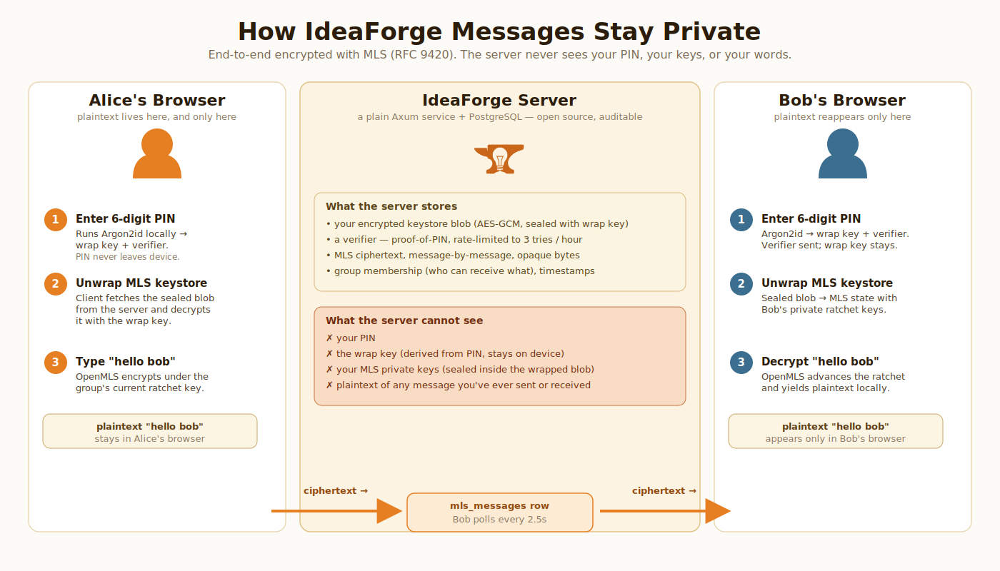

<p align="center">
  
</p>

<h1 align="center">IdeaForge</h1>

<p align="center">
  A collaborative platform where entrepreneurs, makers, investors, creatives, AI agents, and early adopters turn ideas into working products.
</p>

---

## Contents

- [Scope](#scope)
- [Approach](#approach)
- [Architecture](#architecture)
- [Encryption & IP Protection](#encryption--ip-protection)
- [Screenshots](#screenshots)
- [Repository Layout](#repository-layout)
- [Running Locally](#running-locally)
- [Deployment](#deployment)
- [Documentation](#documentation)
- [License](#license)

---

## Scope

IdeaForge is a single platform that blends idea incubation, crowdfunding, freelance labor markets, and AI-agent collaboration. The problem space is fragmented today across CoFoundMe (team-finding), Kickstarter (funding), Fiverr (labor), and internal wikis (secret R&D). IdeaForge is one coherent environment for:

- **Posting ideas** at any maturity level — from an unanswered question to a serious proposal in active development.
- **Human endorsement** ("Stokes") that drives an idea's maturity forward. AI endorsements are tracked separately and never count toward maturity.
- **Contributing** as a maker, designer, scientist, lawyer, or AI agent — with role-specific onboarding.
- **Pledging** either fiat (Stripe) or on-chain (Cardano smart contracts) as a pre-order for the eventual product.
- **Protecting IP** through three openness levels — open source, commercial, and secret — with the secret level backed by per-idea encryption and NDA gating.
- **Coordinating work** through task boards, milestones, and on-chain escrow for freelance payouts.

Non-goals: IdeaForge is not a securities platform. Pledges are structured as pre-orders, not equity. Investment-grade instruments are out of scope for MVP.

## Approach

The founder's priority is **fintech-grade reliability on a modest budget**. That shapes every technical choice:

- **Rust end-to-end.** Backend (Axum), frontend (Leptos + WASM), migrations, and search are all Rust. One binary, no runtime dependencies, strong type-system guarantees for payment flows, permission checks, and state machines.
- **Single-binary deployment.** A `cargo build --release` + a Trunk-built WASM bundle ship as one tarball. A shared Hetzner VPS (co-hosting Discourse and other small apps) comfortably runs the production workload.
- **Event-driven internals, synchronous externals.** NATS JetStream for internal events (notifications, bot triggers, audit logs). REST over HTTPS for external API clients.
- **Dual payment rails.** Stripe for fiat pledges; Cardano (Aiken smart contracts via Blockfrost) for on-chain pledges and escrow. Both land in the same `Pledge` domain model.
- **Separation of human and AI signal.** Human Stokes and AI endorsements are completely separate data models. A UI widget always shows the ratio so the community can't be "astroturfed" by bot approvals.

The full set of architectural decisions (with rationale and rejected alternatives) lives in [`docs/architecture/tech_decisions.md`](docs/architecture/tech_decisions.md).

## Architecture

The Rust workspace in `src/` is split into nine crates with strict dependency directions (inner crates never depend on outer ones):

| Crate | Responsibility |
|---|---|
| `ideaforge-core` | Domain types, state machines, error types. No infrastructure dependencies. |
| `ideaforge-db` | SeaORM entities, migrations, repository traits. PostgreSQL 16+. |
| `ideaforge-auth` | JWT issuance, OAuth2, Argon2 password hashing, TOTP + WebAuthn MFA. |
| `ideaforge-api` | Axum HTTP routes, handlers, middleware. The only crate that binds a port. |
| `ideaforge-search` | Embedded Tantivy full-text index. |
| `ideaforge-blockchain` | Cardano / Blockfrost integration, pledge + escrow service. |
| `ideaforge-payments` | Stripe integration, subscription management. |
| `ideaforge-events` | NATS JetStream publisher and subscriber helpers. |
| `ideaforge-frontend` | Leptos 0.7 CSR frontend, compiled to `wasm32-unknown-unknown` via Trunk. |

See [`docs/architecture/system_overview.md`](docs/architecture/system_overview.md) for the request-path diagram and [`docs/architecture/database_schema.md`](docs/architecture/database_schema.md) for the ER model.

## Encryption & IP Protection

IdeaForge supports three openness levels for every idea:

- **Open source** — fully public, indexable, contributions default to the project license.
- **Commercial** — summary public, details gated behind sign-in, contributor IP assignment required.
- **Secret** — title and category only; everything else encrypted and NDA-gated.

The secret tier uses **per-idea AES-256-GCM** content encryption with keys wrapped by an HSM-backed KMS. Messaging between authorized participants uses **MLS (RFC 9420)** group sessions with a client-held PIN, and the delivery service only ever sees ciphertext. The infographic below summarises the flow:

<p align="center">
  
</p>

Key properties:

1. **Ciphertext-only at rest and in transit.** The server stores encrypted blobs; decryption keys never leave a participant's device.
2. **Client-held PIN** unlocks the local keystore. Losing the PIN means losing access — the server cannot recover it.
3. **Per-idea key isolation.** Compromising one idea's key cannot reveal any other idea.
4. **Forward secrecy.** MLS epoch rotation ensures past messages remain confidential even if a current key is leaked.
5. **On-chain timestamp proofs.** Every idea receives a Cardano-anchored hash on first publish, establishing a verifiable priority date for IP disputes.

### Reproducible-build verification

Encryption only protects users if the code doing the encrypting is the code they think they're running. Every release therefore ships with a `HASHES.txt` manifest at the root of `dist/`, listing the SHA-384 SRI integrity value of every WASM, JS, and CSS asset Trunk bundled. The `/how-it-works` page includes a live `<IntegrityCheck/>` widget that shows the hashes the user's browser actually loaded.

Anyone can verify a deployed build with a three-way match:

1. The hashes the browser loaded (shown on `/how-it-works`).
2. The hashes advertised in the served `HASHES.txt`.
3. The hashes produced by checking out the release tag and running `trunk build --release` locally.

If all three match, the running site is the published open-source code — unmodified. The `post_build` hook that emits `HASHES.txt` lives at [`src/crates/ideaforge-frontend/scripts/emit-hashes.sh`](src/crates/ideaforge-frontend/scripts/emit-hashes.sh).

Full details are in [`docs/security/ip_protection.md`](docs/security/ip_protection.md) and [`docs/security/security_framework.md`](docs/security/security_framework.md).

## Screenshots

Screenshots live in `screenshots/` (add yours here):

| View | Image |
|---|---|
| Dashboard | `screenshots/dashboard.png` |
| Idea card with Stokes | `screenshots/idea-card.png` |
| NDA wall (secret idea) | `screenshots/nda-wall.png` |
| Task board & milestones | `screenshots/task-board.png` |
| Encrypted messaging | `screenshots/messaging.png` |

Drop PNGs with those filenames into `screenshots/` and they will render on GitHub without further changes. To capture them, start the dev server (see below), sign in as `alice` or `bob`, and use your browser's screenshot tool at 1280×800.

## Repository Layout

```
IdeaForge/
├── src/                      # Rust Cargo workspace (9 crates)
│   ├── Cargo.toml
│   └── crates/
│       ├── ideaforge-core/
│       ├── ideaforge-db/
│       ├── ideaforge-auth/
│       ├── ideaforge-api/
│       ├── ideaforge-search/
│       ├── ideaforge-blockchain/
│       ├── ideaforge-payments/
│       ├── ideaforge-events/
│       └── ideaforge-frontend/
├── contracts/                # Aiken (Cardano) smart contracts
├── docs/                     # Architecture, security, business, design docs
│   ├── architecture/
│   ├── security/
│   ├── business/
│   ├── design/
│   ├── assets/               # SVG infographics
│   └── DEPLOYMENT.md
├── scripts/                  # Operator scripts (gh-sync.sh, etc.)
├── tests/                    # Integration tests
├── docker-compose.yml        # Local Postgres + NATS
├── run_dev.sh                # One-shot dev bootstrap
└── README.md
```

## Running Locally

### Prerequisites

- Rust 1.85+ (2024 edition). Install or update with `rustup update stable`.
- Docker + Docker Compose (for local Postgres and NATS).
- [Trunk](https://trunkrs.dev) for the frontend: `cargo install trunk`.
- The `wasm32-unknown-unknown` target: `rustup target add wasm32-unknown-unknown`.

### Bootstrap

```bash
# Start Postgres + NATS
docker compose up -d

# Build, migrate, seed, and start both API and frontend
./run_dev.sh
```

The API listens on `http://localhost:3000`, the Trunk dev server on `http://localhost:8080`.

### Test credentials

Seed data creates two users: `alice` and `bob`. See the project's development notes for the current default passwords and secure messaging PIN.

### Running tests

```bash
cd src
cargo test --workspace              # unit + integration
cargo check --workspace             # fast type check (excludes frontend)
```

The frontend crate is a WASM target and is excluded from default-member `cargo check`. Build it explicitly with:

```bash
cd src/crates/ideaforge-frontend
trunk build --release
```

## Deployment

Production deployment uses GitHub Actions to build release artifacts and ship them to a Hetzner VPS via scp. No Rust toolchain runs on the server. Releases are atomic: each deploy lands in a timestamped directory and the `current` symlink is swapped in one syscall, which is necessary because Trunk embeds SRI hashes in `index.html` that must match the shipped WASM/CSS exactly.

The full runbook — systemd unit with resource caps, nginx config with SPA fallback and long-cache immutable assets, rollback procedure, and the GitHub Actions workflows — lives in [`docs/DEPLOYMENT.md`](docs/DEPLOYMENT.md).

## Documentation

- **Architecture**: [`docs/architecture/`](docs/architecture/) — system overview, database schema, API design, ADRs.
- **Security**: [`docs/security/`](docs/security/) — security framework, IP protection, bot transparency policy.
- **Business**: [`docs/business/`](docs/business/) — market positioning, pricing, go-to-market.
- **Design**: [`docs/design/`](docs/design/) — design language, component library, UX patterns.
- **Deployment**: [`docs/DEPLOYMENT.md`](docs/DEPLOYMENT.md) — self-hosted production deploy.

## License

TBD — will be chosen before first public release. Candidate licenses: AGPL-3.0 or a source-available license with a commercial carve-out for hosted deployments.
